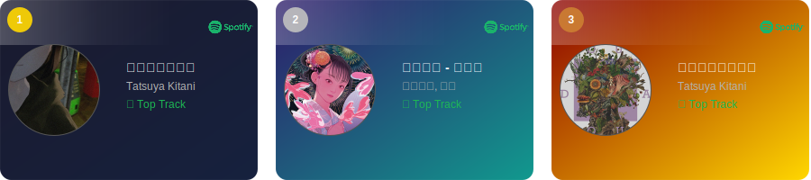

<!-- 1. GitHub usernameを変更 -->

  

<!-- 2. プロフィールや連絡先を変更 -->
##  いらっしゃい
- 🎓 立命館大学情報理工学部にいます
- 🧑‍💻 バックエンドが好きです
- 🌱 最近はGoとかアーキテクチャに興味があります  

  
  &nbsp;
  

 

---

<!-- 3. 好きな技術スタックに変更 -->
<!-- ライトモート：theme=light, ダークモート：theme=dark -->
<!-- アイコンの選択肢一覧：https://arc.net/l/quote/zizyykfh -->
## 🌱 できること・やったことあること
### バックエンド

### モバイル

### その他いろいろ

 

---

<!-- 4. GitHub usernameを変更, 2箇所 -->
## 🏃‍♀️ 最近の活動

 
  
  

---

<!-- SPOTIFY_ACTIVITY_START -->
## 🎧 いま聴いてる

## 🏆 Top Tracks (last 1 month)

<!-- SPOTIFY_ACTIVITY_END -->
